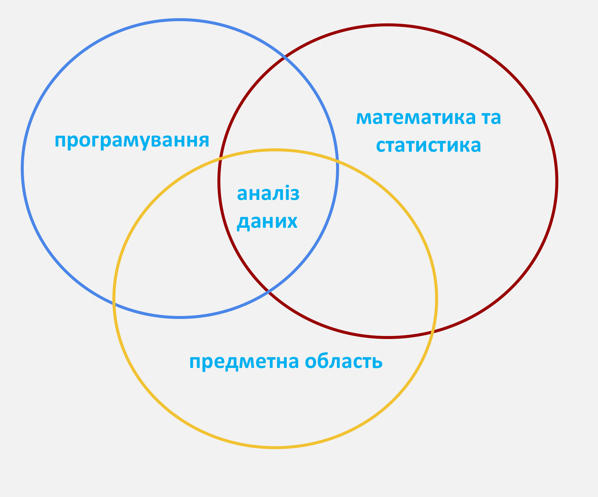
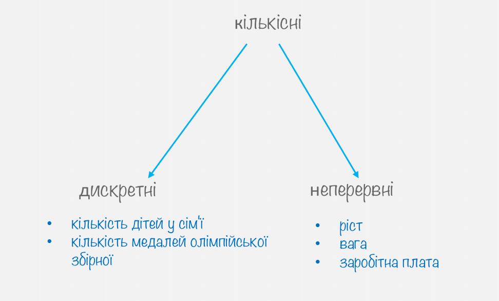
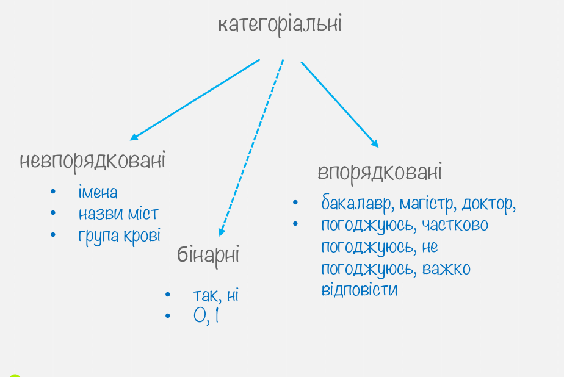
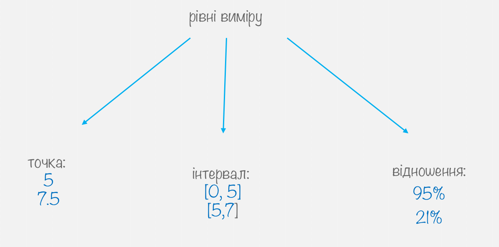
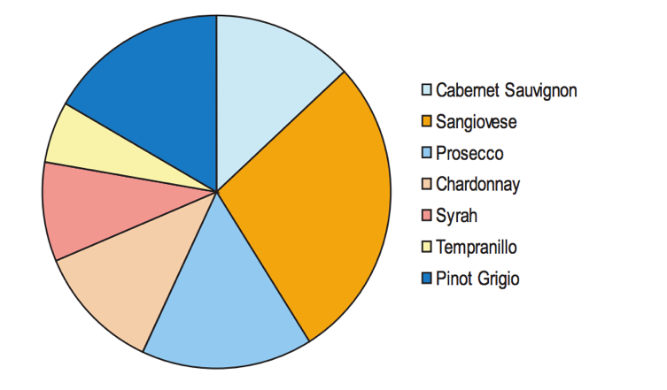
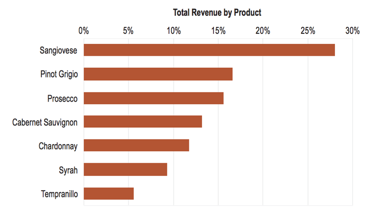

# Аналіз даних 

Що потрібно знати, для того щоб займатись аналізом даних? Є три основні компоненти.

 

В першу чергу це знання предметної області. Це дозволяє розуміти, які проблеми потребують першочергового вирішення. Друге – це знання математики та статистики. Вони дозволяють формалізувати рішення, перевести його в алгоритм та оцінити, яка ймовірність отримати результат. Оскільки зараз є можливість застосовувати величезні обчислювальні потужності, тому вміння програмувати є важливим для побудови моделей.


# Процес аналізу даних 

 

Складається з трьох етапів. Спочатку дані потрібно підготувати, тобто зібрати, очистити та відібрати ті, які потрібні для моделі. Цей процес займає близько 90% часу. Далі ми будуємо модель та валідуємо її результати.
Останній етап – це презентація результатів. Тут ми демонструємо на яке питання ми шукали відповідь, які дані використовували та що отримали в результаті. Для того щоб це зробити максимально ефективно треба витрати ще 90% часу. 


# Статистика

Davidian та Louis пропонують наступне визначення:

> "Statistics is the science of learning from data, and of measuring, controlling, and communicating uncertainty; and it thereby provides the navigation essential for controlling the course of scientific and societal advances"  Davidian, M. and Louis, T. A., 10.1126/science.1218685.

тобто 

> Статистика -  наука про навчання на основі даних, про вимірювання, контроль та тлумачення невизначеності; має важливе значення для управління ходом наукових і соціальних досягнень.

Статистика допомагає **оцінити варіативність** та **зменшити невизначеність**.
Розрізняють описову та вивідну статистики. 

* Описова - вивчає властивості спостережуваних даних.
  + Вивідна статистика – виводимо припущення про властивості розподілу даних з яких походять спостережувані дані

З допомогою статистики можна дати відповідь на питання 

* чи є залежність між кількістю злочинів та фазою Місяця? 
 + яка ймовірність викликати Uber в Києві?
 + побудувати довірчий інтервал часу, за який ви потрапляєте на роботу
 + проводити опитування та трактувати їх результати

# Дані


 
 

# Рівні виміру

 

# Матриця даних

Матриця даних – стартовий елемент для аналізу даних. Зазвичай йому передує етап збору, очищення та представлення у табличному вигляді. По рядках  – респонденти, суб’єкти, учасники, спостереження
По стовпцях - xарактеристики кожного запису(змінні).  Також важливо звертати увагу на одиниці виміру а також яким чином були зібрані ці дані.
Ця таблиця включає в себе 6 рядків, однак зібрані нами дані мають майже 800 спостережень(спостереження зібрані з ресурсу <dom.ria.ua> і містять інформацію про квартири, які продаються). Для того, щоб описати вміст цієї таблиці в більш зрозумілій формі використовують узагальнення та опис типових чи середніх значень. Для цього важливо знати тип даних.


```{r,  echo=FALSE, warning=FALSE, message=FALSE}
library(ggplot2)
library(dplyr)

theme_xkcd <- theme(
  #panel.background = element_rect(fill="white"),
  #axis.ticks = element_line(colour=NA),
  #panel.grid = element_line(colour="blue", size=3),
  axis.text.y = element_text(colour="grey"),
  axis.text.x = element_text(colour="grey"),
  axis.title.y = element_text(colour="grey"),
  title = element_text(colour="grey"),
  text = element_text(size=16, family="Comic Sans MS")
)

flats <- read.csv("flats.csv", dec=",")

```

```{r, echo=FALSE, warning=FALSE, message=FALSE}
library(knitr)
kable(head(flats[,c(2:5)]))

```


# Частотні таблиці

Для узагальнення категоріальних даних використовують частотні таблиці. Ця таблиця містить кількість квартир, що продаються у кожному місті.

```{r, echo=FALSE, warning=FALSE, message=FALSE}
library(dplyr)
library(knitr)

res <- flats %>%
  count(Місто)
kable(res)

```


# Центральна тенденція

Опис центральної тенденції. Центральне або типове значення дозволяє зрозуміти основну характеристику даних

## Середнє значення

Середнє значення підходить для узагальнення кількісних даних(як дискретних, так і неперервних). 
Формула обрахування проста:
$$\frac{\sum_{i=1}^n X_i}{n}$$

Тобто ми суму всіх чисел, ділимо на їх кількість.
Наприклад, якщо в нас є група з 5 учнів, оцінки яких 12, 3, 5, 10, 5. Сума їх оцінок дорівнює 35, а середнє значення 7.
Однак із використанням середнього значення в якості опису центральної тенденції в даниї є невелика проблема. Якщо є нетипово великі чи малі для даного набору значення – вони роблять великий внесок у значення середнього. 
Нехай у нас є певне невелике підприємство, яке має 5 працівників. Заробітні плати працівників в гривнях: 5000, 7000, 2000, 4000, 50 000. Середнє значення заробітної плати 13600 грн. Однак, якщо ми відкинемо екстремальне значення 50 000, то отримаємо, що середнє значення зменшилося до 4500. 

## Медіана

**Медіана – це значення, яке ділить вибірку навпіл, тобто 50% є меншими за це значення, 50% більшими.** Основна перевага використання медіани - менша чутливість до екстремальних значень. 
Для пошуку медіани, дані треба розташувати в зростаючому порядку та поділити на дві частини. Якщо в нас парна кількість спостережень то сусідні значення по краях сумуються та діляться на два.  У випадку попереднього прикладу із заробіною платою:
2000, 4000,  5000, 7000, 50 000
Маємо, що посередині знаходиться значення 5000, то краще описує центральну тенденцію заробітної плати на підприємстві.


Що робити, якщо дані не є кількісними?

## Мода
Мода використовується для визначення  центральної тенденції категоріальних або кількісних дискретних даних. **Мода - це значення, яке найчастіше трапляється.**
Наприклад, за інформацією міністерства юстиції України, минулого року хлопчиків найчастіше називали Дмитром, Артемом, Максимом та Іваном, дівчаток – Анею,Анастасією, Софією та Дар’єю. <http://tyzhden.ua/News/137908>
Ці імена є модою серед всіх імен.

# Візуальний аналіз

В 1848 в лондонському районі Сохо було зафіксовано спалах холери, під час якого загинуло 616 жителів.  Під час цього спалаху Лікар епідеміолог Джон Сноу на основі візуального аналізу даних зробив припущення, що джерелом зараження є вода.


<https://en.wikipedia.org/wiki/John_Snow>
<http://blog.rtwilson.com/john-snows-cholera-data-in-more-formats/>

Проблема вакцинації  та відмови від вакцинації актуальна не лише для України. Після опублікованого у 1998 році в британському медичному журналі дослідження де щеплення були вказані як причина аутизму кількість батьків, які відмовляються від щеплень збільшилась. Дослідення визнали помилковим, однак це не вплинуло на зростання кількості жителів США, які відмовлялися робити щепленння. Видання WSJ підготувало інтерактивні візуалізації, які відображають рівень захворюваності на кір, поліомієліт, кашлюк та інші хвороби до і після запровадження вакцини. Дані показують рівень захворюваності у США протягом 80 років

<http://graphics.wsj.com/infectious-diseases-and-vaccines/>

# Типи діаграм

## Стовпчкова діаграма

Використовується для візуалізації категоріальних або кількісних дискретних даних. 

```{r, echo=FALSE, warning=FALSE, message=FALSE, fig.height=4, fig.width=8}
p <- ggplot(flats, aes(x=Кімнат)) + 
  geom_bar(fill="lightblue",
                 col="grey") +
  ylab('Кількість')+
  theme_xkcd
p

p <- ggplot(flats, aes(x=Кімнат)) + 
  geom_bar(fill="lightblue",
                 col="grey") +
  coord_flip() +
  ylab('Кількість')+
  theme_xkcd
p

```

## Стовпчкова діаграма для двох змінних

Маємо категоріальну змінну місто та дискретну змінну кількість кімнат. Залежно від того, чи нас цікавить розуміння внеску кожної категорії чи порівння категорій між собою вибираємо тип візуалізації.

```{r, echo=FALSE, warning=FALSE, message=FALSE, fig.height=4, fig.width=8}
p <- ggplot(flats, aes(x=Місто, fill=factor(Кімнат))) + 
  geom_bar(position="stack") +
  ylab('Кількість')+
  coord_flip()+
  theme_xkcd + theme(legend.position="none")

p


p <- ggplot(flats, aes(x=Місто, fill=factor(Кімнат))) + 
  geom_bar(position="dodge") +
  ylab('Кількість')+
  coord_flip()+
  theme_xkcd + theme(legend.position="none")

p
```

## Кругова діаграма

Використовується для візуалізації категоріальних або кількісних дискретних даних з метою зрозуміти відношення складових до загального значення. Нехай ми аналізуємо дохід від продажу вина і хочемо зрозуміти частку кожного сорту в загальному продажі.

 

Якщо ви захочете порівняти Caberne Sauvignon та Prosecco, то оцінити різницю між ними досить тяжко. 

Ці ж самі дані моджуть бути візуалізовані з допомогою стовпчикової діаграми:

 
Де зрозуміло, що різниця між доходом від продажу Caberne Sauvignon та Prosecco складає приблизно 3%.
Власне, популярна R бібліотека ggplot2 навіть не має фунціоналу для кругової діаграми.


## Точкові графіки
Кожна точка на графіку репрезентує одне спостереження. Тут ви бачите приклад не зовсім вдало підібраного графіку, оскільки візуалізується загальна площа квартир, що продаються. Загальна площа  - неперервна кількісна змінна. Для її візуалізації краще використовувати гістограми. А точкові діаграми краще підходять для візуалізації дискретних даних.

```{r, echo=FALSE, warning=FALSE, message=FALSE, fig.height=4, fig.width=8}

res <- flats %>%
  count(Загальна_площа)
res <- data.frame(res)
res1 <- res
add_data <- res1

for (i in 1:nrow(res1)){
  if (res1$n[i] > 1){
    for (j in 1:res1$n[i]){
      new_data <- c(res$Загальна_площа[i], j)
      add_data <- rbind(add_data, new_data)
    }
  }
}


p <- ggplot(add_data, aes(x=Загальна_площа, y=n)) + 
  geom_point(col='lightblue', size=2) +
  ylab('Кількість')+
  theme_xkcd
p

```

## Гістограма 

Використовується для оцінки форми розподілу кількісної змінної. На цьому графіку розподіл квартир, які продаються за загальною площею.

```{r, echo=FALSE, warning=FALSE, message=FALSE, fig.height=4, fig.width=8}
p <- ggplot(flats, aes(x=Загальна_площа)) + 
  geom_histogram(breaks=seq(0, 250, by = 25),
                 fill="lightblue",
                 col="grey") +
  ylab('Кількість')+
  theme_xkcd
p

```

Залежно від розміру інтервалу її форма може змінюватися. Наприклад змінимо інтервал з 25 метрів квадратних до 100:

```{r, echo=FALSE, warning=FALSE, message=FALSE, fig.height=4, fig.width=8}
p <- ggplot(flats, aes(x=Загальна_площа)) + 
  geom_histogram(breaks=seq(0, 250, by = 50),
                 fill="lightblue",
                 col="grey") +
  ylab('Кількість')+
  theme_xkcd
p

```

## Діаграма розсіювання

Використовується для оцінки зв'язку двох кількісних змінних.

```{r, echo=FALSE, warning=FALSE, message=FALSE, fig.height=4, fig.width=8}

flats$Ціна_usd <- flats$Ціна/25
p <- ggplot(flats, aes(x=Загальна_площа, y=Ціна_usd)) + 
  xlim(c(0, 60))  + ylim(c(0, 80000)) +
  geom_point(col='lightblue', size=2) +
  xlab('Загальна площа') + ylab('Ціна в usd') +
  theme_xkcd
p

```

## Лінійний графік

Може використовуватись для оцінки зміни однієї чи кількох змінних у часі.
Інформація Державної служби статистики 
<https://ukrstat.org/uk/operativ/operativ2005/osv_rik/osv_u/vuz_u.html>

```{r, echo=FALSE, warning=FALSE, message=FALSE, fig.height=4, fig.width=8}
vnz <- read.csv("vnz.csv", dec=",", header = FALSE)
p <- ggplot(vnz, aes(x=V1, y=V3+V2)) + 
  geom_line(colour="blue") +
  ylim(c(0, 1200)) +
  ylab('Кількість')+
  xlab('')+
  ggtitle('Кількість ВНЗ в Україні, 1990-2015')+
  theme_xkcd
p

```

## Як обрати графік?

При виборі типу графіка для візуалізації потрібно розуміти тип даних та що ви хочете зрозуміти.
 
* **Порівнювати значення:** стовпчикова діаграма, лінійний графік, графік розсіювання.
 + **Зрозуміти композицію(виділити складові):**  стовпчикова діаграма, кругова діаграма.
 + **Оцінити розподіл даних:** лінійний графік, графік розсіювання, стовпчикова діаграма, гістограма.
 + **Зрозуміти тренд:** лінійний графік, стовпчикова діаграма.
 + **Зрозуміти відношення між даними:** лінійний графік, графік розсіювання.


# Трактування результатів

Трактування результатів чи не найважливіша частина дослідження. Невірне трактування результатів дослідження дозволяє здійснювати маніпуляції. Детальніше про це можна прочитати у книзі  Darell Huff "How to Lie with Statistics", яка була видана ще в 1954 році. Однак, іноді складається ситуація, що й правильне дослідженне може мати двояке трактування.

## Парадокс Сімпсона

Парадокс Сімпсона названо на честь дослідника Едварда Сімпсона, який у 1951 описав цей феномен. Хорошою ілюстрацією буде ситуація, що склалася в університеті Берклі в 1973. Тоді університет звинуватили в гендерній нерівності. Для ілюстрації ми дещо спростимо вихідні умови. Нехай в університеті є всього два факультети: A та В. 

### Факультет А

```{r, echo=FALSE, warning=FALSE, message=FALSE}

подало_заяв <- c(900, 100)
прийнято <- c(450, 80)

dep_a <- data_frame(подало_заяв, прийнято)
dep_a$відсоток_прийнятих  <- dep_a$прийнято/dep_a$подало_заяв *100
row.names(dep_a) <- c("чоловіки", "жінки")

kable(dep_a)


```

### Факультет B

```{r, echo=FALSE, warning=FALSE, message=FALSE}

подало_заяв <- c(100, 900)
прийнято <- c(10, 180)

dep_b <- data_frame(подало_заяв, прийнято)
dep_b$відсоток_прийнятих  <- dep_b$прийнято/dep_b$подало_заяв *100
row.names(dep_b) <- c("чоловіки", "жінки")

kable(dep_b)

```


Якщо ми подивимось на відсоток прийнятих окремо по факультетах A та B то можемо зробити висновок, що дискріминують чоловіків. Однак, якщо об'єднати результати кількості прийнятих по факультетах, то ситуація виявиться зовсім іншою:

### Разом факультети А та В

```{r, echo=FALSE, warning=FALSE, message=FALSE}

подало_заяв <- c(1000, 1000)
прийнято <- c(460, 260)

dep_a_b <- data_frame(подало_заяв, прийнято)
dep_a_b$відсоток_прийнятих  <- dep_a_b$прийнято/dep_a_b$подало_заяв *100
row.names(dep_a_b) <- c("чоловіки", "жінки")

kable(dep_a_b)
```

Тут вже можна припускати факт наявності дискримінації жінок.

Візуалізацію повної версії можна переглянути тут: <http://vudlab.com/simpsons/>