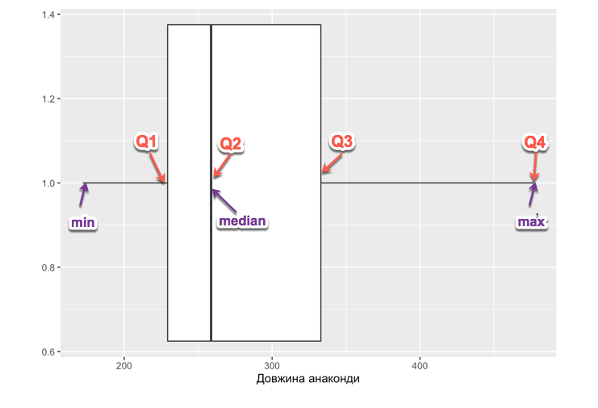

# Матриця даних

Матриця(таблиця) даних – стартовий елемент для аналізу даних. Зазвичай йому передує етап збору, очищення та представлення у табличному вигляді. По рядках  – респонденти, суб’єкти, учасники, спостереження
По стовпцях - xарактеристики кожного запису(змінні).  Також важливо звертати увагу на одиниці виміру а також яким чином були зібрані ці дані.

Приклад таблиці:

```{r,  echo=FALSE, warning=FALSE, message=FALSE}
library(ggplot2)
library(dplyr)
library(knitr)

theme_xkcd <- theme(
  #panel.background = element_rect(fill="white"),
  #axis.ticks = element_line(colour=NA),
  #panel.grid = element_line(colour="blue", size=3),
  axis.text.y = element_text(colour="grey"),
  axis.text.x = element_text(colour="grey"),
  axis.title.y = element_text(colour="grey"),
  title = element_text(colour="grey"),
  text = element_text(size=16, family="Comic Sans MS")
)

flats <- read.csv("flats.csv", dec=",")
kable(head(flats))

```

Спостереження зібрані з ресурсу <https://dom.ria.com/> і містять інформацію про квартири, які продаються. Будемо детальніше аналізувати цей датасет в лабораторній роботі.

# Центральна тенденція

Минулого тижня ми розглянули опис центральної тенденції. Залежно від даних, в якості центральної тенденції використовується середнє значення, медіана або мода

**Середнє значення** підходить для узагальнення кількісних даних(як дискретних, так і неперервних). 
Формула обрахування проста:
$$\frac{\sum_{i=1}^n X_i}{n}$$

Тобто ми суму всіх чисел, ділимо на їх кількість.
Наприклад, якщо в нас є група з 5 учнів, оцінки яких 12, 3, 5, 10, 5. Сума їх оцінок дорівнює 35, а середнє значення 7.
Однак із використанням середнього значення в якості опису центральної тенденції в даниї є невелика проблема. Якщо є нетипово великі чи малі для даного набору значення – вони роблять великий внесок у значення середнього. 
Нехай у нас є певне невелике підприємство, яке має 5 працівників. Заробітні плати працівників в гривнях: 5000, 7000, 2000, 4000, 50 000. Середнє значення заробітної плати 13600 грн. Однак, якщо ми відкинемо екстремальне значення 50 000, то отримаємо, що середнє значення зменшилося до 4500. 


**Медіана – це значення, яке ділить вибірку навпіл, тобто 50% є меншими за це значення, 50% більшими.** Основна перевага використання медіани - менша чутливість до екстремальних значень. 
Для пошуку медіани, дані треба розташувати в зростаючому порядку та поділити на дві частини. Якщо в нас парна кількість спостережень то сусідні значення по краях сумуються та діляться на два.  У випадку попереднього прикладу із заробіною платою:
2000, 4000,  5000, 7000, 50 000
Маємо, що посередині знаходиться значення 5000, то краще описує центральну тенденцію заробітної плати на підприємстві.

**Мода** - значення, яке найчастіше трапляєтться. Може використовуватись як для категоріальних, так і для кількісних даних. Дані можуть мати кілька мод, а можуть не мати жодної.

# Квартилі та інтерквартильний розмах.

Якщо медіана ділить дані порівну, то квартилі ділять їх на чотири частини. Вони позначаються Q1, Q2, Q3, Q4.

* Q1 - 25%
  + Q2 - 50% (співпадає з медіаною)
  + Q3 - 75%
  + Q4 - 100%

**Інтерквартильний розмах(IQR)** = Q3 - Q1

Нехай маємо ряд 62, 81, 63, 77, 64, 81, 64, 70, 72, 76. 

Спочатку відсортуємо дані в зростаючому порядку: 62, 63, 64, 64, 70, 72, 76, 77, 81, 81. 

Медіана(та Q2)): $\frac{70+72}{2} = 71$

Для обрахунку Q1 та Q3 значення медіани включаються до інтервалу.

Q1: $\frac{64 + 64 }{2} = 64$

Q3:  $\frac{76 + 77 }{2} = 76.5$

**Інтерквартильний розмах(ІКР):** Q3 - Q1 = 76.5 - 64 = 12.5 

Середнє, мода та медіана є описовими статистиками. Також виділяють **узагальнення п'яти чисел** (five numbers summary). Воно включає в себе:

* Найменше значення
  + Перший квартиль
  + Медіана (другий квартиль)
  + Третій квартиль
  + Найбільше значення

Узагальнення п'яти чисел для ряду можна отримати використовуючи R функцію `summmary`.

```{r}
summary(c(62, 81, 63, 77, 64, 81, 64, 70, 72, 76))
```

Наприклад, застосуємо цю статистику для оцінки довжини анаконд (завантажити набір даних можна за посиланням <http://www.public.iastate.edu/~maitra/stat501/datasets/anaconda.dat>):

```{r}
anaconda <- read.table("anaconda.dat")
summary(anaconda$V1)
quantile(anaconda$V1)
```


# Коробчата діаграма

Дозволяє візуалізувати yзагальнення п'яти чисел та знайти нетипові дані(так звані "викиди") **"Викид"** (outlier) - значення, яке знаходиться на відстані, меньшій ніж 1.5 ІКР від Q1 або більшій від Q3.


Якщо ми хочемо детальніше оцінити розподіл довжини анаконд, можемо використати гістограму:

```{r}
ggplot(anaconda, aes(x=V1)) + 
  geom_histogram(breaks=seq(0, 500, by = 50),fill="lightblue", col="grey") +
  xlab("Довжина анаконди") + ylab("Кількість спостережень")
```


# Дисперсія та середньоквадратичне відхилення

Середньоквадратичне відхилення(standard deviation) дає розуміння, наскільки далеко знаходиться типове спостереження від середнього значення.

**Дисперсія(variance)** - обчислюється як середнє значення відстаней від всіх спострежень до середнього значення у квадраті. 

$$var =\frac{\sum\limits_{i=1}^{N}(x_{i} - \mu)^2} {N}$$

**Середньоквадратичне відхилення(standard deviation)** $\sigma$- обчислюється як корінь квадратний з дисперсії.

$$\sigma =\sqrt{\frac{\sum\limits_{i=1}^{N}(x_{i} - \mu)^2} {N}}$$

Давайте обрахуємо дисперсію та середньоквадратичне відхилення.

Нехай у нас є ряд: `5, 3, 2, 8, 2`. 

Середнє значення $\mu = 4$.

Обчислимо дисперсію та середньоквадратичне відхилення:

Дисперсія:

$$var = \frac{(5-4)^2+(3-4)^2+(2-4)^2+(8-4)^2+(2-4^2)}{5} = \frac{1^2 + (-1)^2+(-2)^2+4^2+(-2)^2 }{5} = \frac{1+1+4+16+4}{5}=5.2$$


Середньоквадратичне відхилення:

$$\sigma = \sqrt{var} = 2.28$$

Дисперсія для ряду `3, 5, 5, 3, 4`, середнє значення якого теж 4:

$$var = \frac{(3-4)^2+(5-4)^2+(5-4)^2+(3-4)^2+(4-4^2)}{5} = \frac{(-1)^2 + 1^2+1^2+ (-1)^2+(0)^2 }{5} = \frac{4}{5}=0.8$$

Середньоквадратичне відхилення:

$$\sigma = \sqrt{var} = 0.89$$

Якщо поглянути на обидва ряди, бачимо що значення другого більш тісно розташовані навколо середнього. Значення дисперсії та середньоквадратичного дозволяють це виразити чисельно.

`Приклад:` Степан має 800 друзів у Facebook, Аня 1000  послідовників в Instagram. Хто більш популярний?

Для відповіді на це питання нам потрібні будуть дані про середнє значення та середньоквадратичне відхилення для кількості друзів у Facebook та послідовників у Instagram.

Facebook: середнє значення  $\mu = 649$, середньоквадратичне відхилення $\sigma = 50$

Instagram: середнє значення $\mu =843$,  середньоквадратичне відхилення $\sigma =60$

Обчислимо відстань до середнього значення в середньоквадратичних відхиленнях:

Степан: 
$$ \frac{x - \mu}{\sigma} = \frac{800 - 649}{50} = 3.02$$.

Аня: 
$$ \frac{x - \mu}{\sigma} = \frac{1000 -843}{60} = 2.61$$.

Можемо вважати, що Степан більш популярний, оскільки значення кількості його друзів знаходиться далі від середнього значення.

Процес перетворення даних з допомогою формули $\frac{x - \mu}{\sigma}%$ має назву **z-стандартизація**, а отримані значення - **z-значення**. Наступного тижня розглянемо застосування z-значень для оцінки ймовірності.
