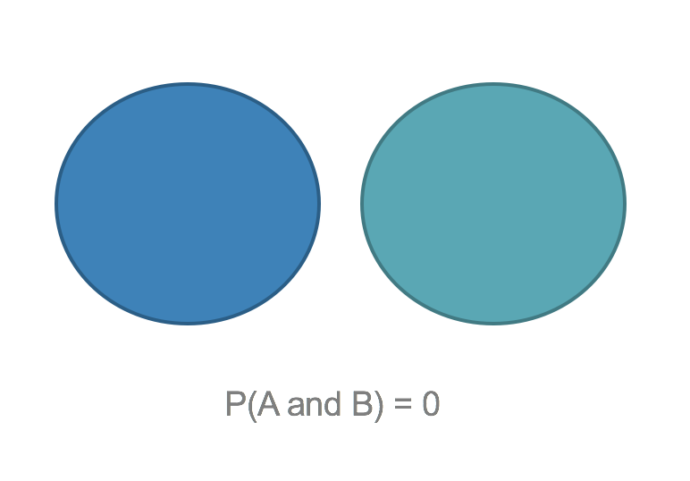
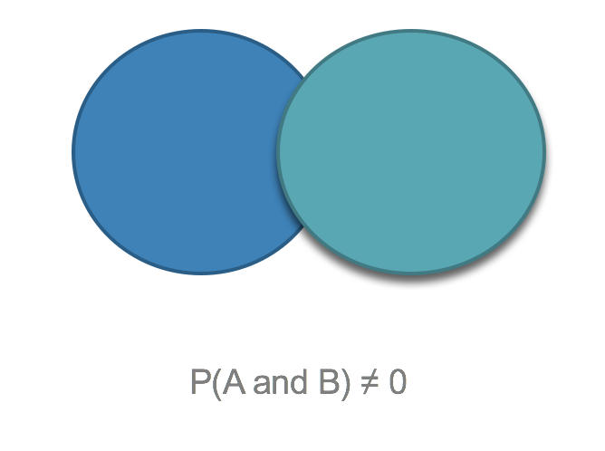
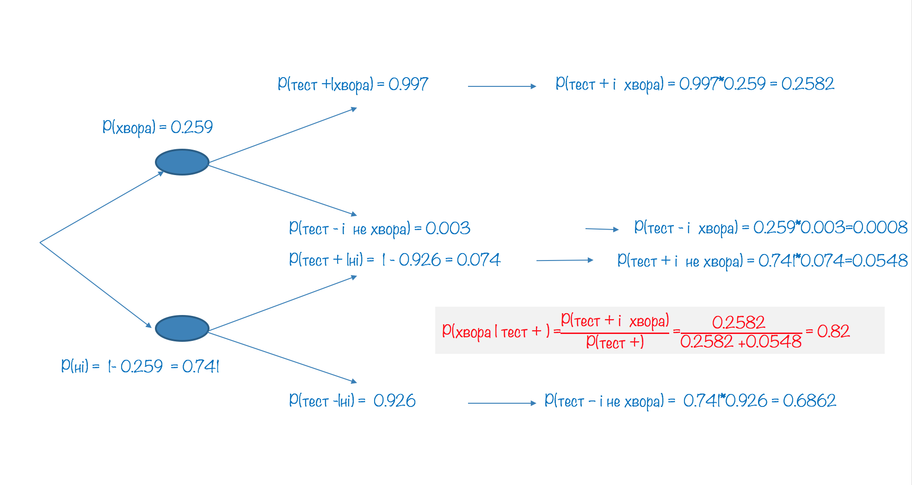
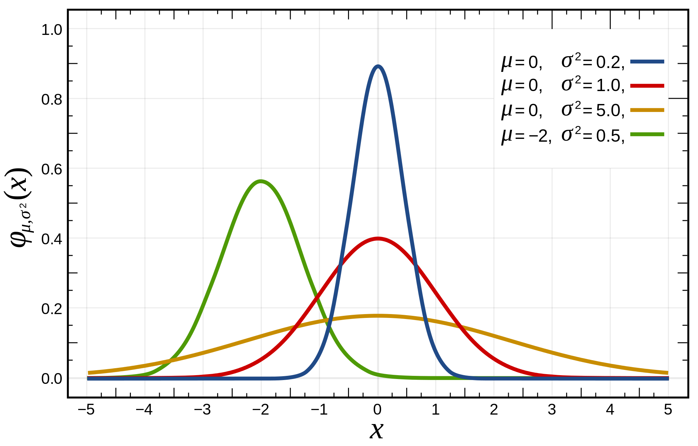
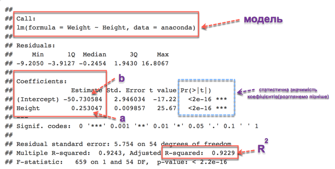

## Ймовірність однієї події

Розглянемо класичний приклад із підкиданням монетки. Коли ми підкидаємо монетку, ми не можемо сказати "орлом" чи "решкою" вона впаде. Підкидання монетки - випробування. **Випробування (експеримент)** – сукупність умов, за яких спостерігається певне явище чи результат. Результатом у прикладі з монеткою є факт, що монетка впала "орлом" або "решкою". Випадання "орла" чи "решки" - подія. **Подія** – факт, який в результаті експерименту може відбутись чи не відбутись.Якщо ми будемо підкидати цю монетку велику кількість раз(наприклад тисячу) і щоразу записувати результат, то зможемо оцінити ймовірність настання кожної події. **Ймовірність** – чисельна міра впевненості в появі даної події внаслідок нового випробування. 

Тобто, якщо нас цікавить, яка ймовірність випадання "решки" для даної монетки, то ми підкидаємо монетку n разів та обчислюємо ймовірність p(A) за формулою $$p(A) =\frac {m}{n}$$ 

де A - подія "монета впала решкою"

p(A) - ймовірність цієї події

m - кількість разів, коли настала подія A

n - кількість випробувань

Оскільки m та n - цілі числа і 0 ≤ m ≤ n, то 0 ≤ P(A) ≤ 1.

**Закон великих чисел** стверджує,  що якщо ми будемо повторювати експеримент нескінченну кількість разів(на практиці просто достатньо багато), то частка настання нашої події до кількості випадків буде наближатися до реальної ймовірності настання цієї події.
На графіку ви бачите, як змінюється ймовірність випадання орла p в залежності від кількості спроб:

```{r, echo=FALSE, message=FALSE, warning=FALSE}
library(ggplot2)

n <- 1000
p <- 0.5

#set.seed(433)

#dataframe

df <- data.frame(bi = rbinom(n, 1, p) , count = 0, mean = 0)
ifelse(df$bi[1] == 1, df[1, 2:3] <- 1, 0)

for (i in 2 : n){
  df$count[i] <- ifelse(df$bi[i] == 1, df$count[i]<-df$count[i - 1]+1, df$count[i - 1])
  df$mean[i] <- df$count[i] / i
}


ggplot(data=df, aes(x=seq(1:n), y=mean)) + geom_point(col='lightblue') +
  ylim(c(0,1)) +
  geom_hline(aes(yintercept=p), linetype="dashed", col="red") +
  xlab('кількість спроб') + ylab('p') 
```

Таке трактування ймовірності має назву **"частотна інтерпретація"** і передбачає, що випробування можна здійснити достатньо велику кількість разів. Існує інший підхід до визначення ймовірності, так звана **"байесівська інтерпретація"**. Вона передбачає, що в нас є якась початкова ймовірність, наприклад корумпованості конкретного чиновника, і ми коригуємо цю ймовірність в залежності від фактів (для чиновника це можуть бути подані декларації, нерухоме майно).

Сума ймовірностей всіх можливих подій, які можуть настати в результаті випробування(для монети це випадання орлом або решкою) дорівнює одиниці.

## Ймовірність кількох подій

Щоб оцінити ймовірність настання кількох подій, потрібно зрозуміти, як вони співвідносяться між собою.  
Події  можуть бути:

**Несумісні(disjoint)** - не можуть відбуватись одночасно. 

Приклад несумісних подій: 

- монета не може впасти і орлом і решкою
- не можна здати і провалити іспит одночасно



Відповідно, якщо для обчислення ймовірністі настання події A або події B, які є несумісними, використаємо формулу:

**P(A or B) = P(A) + P(B)**

**Сумісні(joint)** - можуть відбуватись одночасно.



Студент може одночасно проходити курс статистики та англійської мови. Це приклад сумісних подій, де подія A - проходить курс статистики, подія B - проходить курс англійської мови.

Формула, для визначення ймовірністі настання події A або події B, якщо події є сумісними:  **P(A or B) = P(A) + P(B) – P (A and B)** 

Розглянемо приклад:
Було опитано 77882 людини з 57 країн світу. 36.2% погоджуються з твердженням “Чоловіки повинні мати більше прав ніж жінки”.  13.8% мають університетську освіту.
3.6% належать до обох категорій.

Яка ймовірність, що випадковим чином обрана людина має вищу освіту  або погоджується з твердженням “Чоловіки повинні мати більше прав ніж жінки”?

Події "випадковим чином обрана людина має університетську освіту" та "випадковим чином обрана людина погоджується з твердженням" є сумісними. Тому для обчислення ймовірністі, що випадковим чином обрана людина з вищою освітою  або погоджується з твердженням скористаємось формулою додавання ймовірностей для сумісних подій:  **P(A or B) = P(A) + P(B) – P (A and B)** 

Тобто P(A or B) = 36.2% + 13.8% - 3.6% = 46.4%


Дві події є **незалежними(independent)**, якщо знання про настання однієї з них  не дає можливості оцінити ймовірність настання іншої. Для прикладу, знання того, що надворі йде дощ не дає нам додаткової інформації для оцінки ймовірності виграти в лотереї.

Для обрахування ймовірності настання одночасно **незалежних** подій A та B використовуємо формулу: **P(A and B) = P(A) x P(B)**

Буває ситуація, коли події залежать одна від одної. Наприклад, у дощовий день ймовірність викликати таксі зменшується. Такі ймовірності називають **умовними(conditional)**. 

Можемо записати це так:

P(викликали таксі | дощ) = 0.4

P(викликали таксі |$\neg$дощ) = 0.8

Де знак $\neg$ означає заперечення. Крім того, також є ймовірність дощу в конкретному місті. Така ймовірність називається **апріорною**. Нехай ймовірність дощу в цьому місті дорівнює 0.7. Тоді, відповідно, $\neg$дощ = 0.3.

Для умовних ймовірностей ймовірність одночаного настання подій A та B обчислюється за формулою **P(A and B) = P(A|B) * P(B)**

Якщо ми хочемо обчислити ймовірність викликати таксі, то спочатку оцінимо ймовірність викликати таксі, коли йде дощ і ймовірність цієї події, коли дощу нема.

A - викликали таксі

B - дощ

Використавши формулу P(A and B) = P(A|B) * P(B) маємо:

P(викликали таксі) = P(викликали таксі і дощ) + P(викликали таксі і $\neg$дощ) = P(викликали таксі | дощ) x P(дощ) + P(викликали таксі | $\neg$дощ) x P($\neg$дощ) = 0.4x0.7 + 0.8x0.3 = 0.28 + 0.24 = 0.52


## Теорема Байеса
Теорема Байеса названа на честь проповідника вісімнадцятого сторіччя Томаса Байеса. Теорема має багато застосувань і вважається головною теоремою статистики.

Теорема Байеса(її ще називають правилом Байеса):

$$ P(A \mid B) = \frac{P(B \mid A) \, P(A)}{P(B)} $$

- A та B - події
- P(B) > 0 
- P(A $\mid$ B) ймовірність настання події A, якщо відбулася подія B
- P(B $\mid$ A) ймовірність настання події B, якщо відбулася подія A

Розглянемо це на прикладі:

В 2009 році в найвищий відсоток захворюваності на ВІЛ/СНІД було зафіксовано в Свазіленді і становить 25.9% Тест ELISA один з найкращих та найточніших тестів. Для тих, хто хворий на СНІД тест має точність 99.7%, для тих хто не хворий 92.6%. Якщо за результатами тесту людина ВІЛ інфікована, яка ймовірність що вона дійсно хвора?
 
P(хвора) = 0.259 - пріорна можливість захворіти

P(тест +| хвора) = 0.997  - ймовірність. що тест покаже позитивний результат, якщо людина хвора

P(тест -|нe хвора) =  0.926 ймовірність. що тест покаже негативний результат, якщо людина здорова

Потрібно оцінити  ймовірність що вона дійсно хвора, якщо тест показав позитивний результат, тобто P(хвора | тест +).

За теоремою Байеса:

$$P(хвора \mid тест+) = \frac {P(тест+ \mid хвора)P(хвора) } {P(тест +)}$$

Для обрахунку, нам не вистачає лише інфомації яка ймовірність, що тест дасть позитивний результат для будь-якого жителя(чи жительки) Свазіленда.

P(тест +) = P(тест+ і хвора) + P(тест+ і $\neg$хвора) = P(тест+ $\mid$ хвора)P(хвора) + P(тест+ $\mid$ $\neg$хвора)P($\neg$хвора)


P($\neg$хвора) = 1 - P(хвора) = 0.741 

P(тест + $\mid$ $\neg$хвора) = 1 - P(тест- $\mid \neg$нe хвора) = 1 - 0.926 = 0.074 

P(тест+) = 0.997x0.259 + 0.074x0.741 = 0.2582 + 0.0548  = 0.313

$$P(хвора \mid тест+) = \frac {P(тест+ \mid хвора)P(хвора) } {P(тест +)} = \frac{0.997*0.259}{0.313} = 0.825$$


Для знаходження ймовірностей можемо скористись візуалізацією:



## Класичні розподіли

Якщо ми знаємо, що наші дані належать до якогось з класичних розподілів, то можемо використати вже вивчені властивості цих розподілів. Є дискретні та неперервні класичні розподіли. Як приклад дискретного розглянемо біноміальний, а як приклад неперервного - нормальний розподіл.

**Біноміальний розподіл** - дискретний розподіл, тобто розподіл величини, яка може набирати фіксованих значень. Уявіть собі підкидання монетки 5 разів. Монета може випасти орлом 0, 1, 2, 3, 4 або 5 разів, але не 0.67 чи 3.57. Відповідно змінна, яка описує кількість разів, які монета впала орлом є дискретною змінною.  

Біноміальний розподіл підходить для опису розподілу даних, де результати, можуть набирати лише двох можливих значень (від виходу з ладу деталей машин до студентів, які здають іспит).

Події в біноміальному розподілі генеруються внаслідок процесу Бернуллі. Одне випробування в процесі Бернуллі має назву випробування Бернуллі. Коли кожне випробування має лише два можливих наслідки. Ці наслідки класифікуються як "успіх" чи "невдача". "Успіх" - не обов'язково має позитивний контекст. Наприклад, "успіхом" може бути наслідок "вихід з ладу важливої деталі".

Розглянемо біноміальний розподіл на прикладі експеримента Мілґрема <https://uk.wikipedia.org/wiki/%D0%95%D0%BA%D1%81%D0%BF%D0%B5%D1%80%D0%B8%D0%BC%D0%B5%D0%BD%D1%82_%D0%9C%D1%96%D0%BB%D2%91%D1%80%D0%B5%D0%BC%D0%B0>. 

> Експеримент почався в липні 1961, через три місяці після того, як почався процес над нацистським військовим злочинцем Адольфом Ейхманом в Єрусалимі. Мілґрем задумав експеримент, щоб дати відповідь на питання: "Чи міг Ейхман і мільйони його спільників по Голокосту просто виконувати накази? Чи можемо ми їх всіх називати спільниками?"
Експериментатор (E) вимагав від "вчителя" (T) давати #учневі" (L) прості завдання на запам'ятовування і при кожній помилці "учня" натискати на кнопку, нібито карає його ударом струму (насправді актор, що грав "учня"", тільки вдавав, що отримує удари). Почавши з 15 вольт, "вчитель" з кожною новою помилкою повинен був збільшувати напругу на 15 вольт (верхня допустима межа в експерименті 450 вольт). 
В одній серії дослідів основного варіанту експерименту 26 досліджуваних з 40, замість того щоб змилосердитися над жертвою, продовжували збільшувати напругу (до 450 В) до тих пір, поки дослідник не віддавав розпорядження закінчити експеримент (інформація взята з wikipedia).

Будемо розглядати кожну особу в експерименті Мілгрема як випробування.
**Успіхом** будемо вважати подію, коли особа відмовилась продовжувати експеримент, **невдачею**- якщо погодилась
Оскільки 35%(14 із 40) відмовляється то ймовірність успіху в одній спробі 35%.

Якщо ми виберемо для експерименту трьох випадкових людей, яка ймовірність що один з них відмовиться?
Назвемо цих людей Антон, Богдан та Вікторія.

Якщо відмовиться Антон, то цей варіант опишемо як Варіант 1: (Успіх Невдача Невдача), ймовірність незалежних подій дорівнює добутку ймовірностей, тобто ймовірність того, що відмовиться саме Антон (це означає, що Богдан та Вікторія не відмовляться) дорівнює 0.35 * 0.65 * 0.65 = 0.149.

Якщо відмовиться Богдан, варіант описується як Варіант 2: (Невдача Успіх Невдача), ймовірність 0.65 * 0.35 * 0.65 = 0.149.

Якщо ж відмовиться Вікторія, то маємо Варіант 3: (Невдача Невдача Успіх), ймовірність якого 0.35 * 0.35 * 0.65 = 0.149.

Для оцінки ймовірності, що відмовиться продовжувати одна людина, нам не важливо знати, хто саме це буде. Тобто нам треба знайти ймовірність настання Варінту 1, 2 або 3, що дорівнює сумі ймовірностей цих варіантів і дорівнює 0.44.

Як бачимо, для обчислення ймовірності мати k успіхів в n незалежних випробуваннях Бернуллі з ймовірністю успіху p в кожному випробуванні використовується два компоненти: 

- кількість можливих сценаріїв. Обчислюється за формулою: ${n\choose k} = \frac{n!}{k!(n-k)!}$

- ймовірність одного сценарія  Обчислюється за формулою: ${p^k}{(1-p)^{(n-k)}}$

В загальному формула ймовірності P мати k успіхів в n незалежних випробуваннях Бернуллі з ймовірністю успіху p в кожному випробуванні така:

$$P = {\frac{n!}{k!(n-k)!} }{{p^k}{(1-p)^{(n-k)}}}  $$


Умови:

* Випробування незалежні
  + Кількість випробувань n фіксована
  + Кожен результат класифікується як успіх або невдача
  + Ймовірність успіху p однакова для кожного випробування 

Застосуємо цю формулу для прикладу:
Згідно опитування  Gallup poll 2012 26.2% жителів США мають надмірну вагу. Яка ймовірність серед 20 випадковим чином обраних жителів отримати 5 з надлишковою вагою?

n = 20, 
k = 5, 
p = 0.262

Кількість варіантів: ${n\choose k} = \frac{n!}{k!(n-k)!}$

n! (n факторіал) - добуток всіх чисел від 1 до n (тобто 1 x 2 x 3 x ... x n)

$${n\choose k} = \frac{n!}{k!(n-k)!}  =  \frac{20!}{5!(20-5)!} =  \frac{20!}{5!15!}  =  15504 $$

Можна також використати R функцію `choose`:

```{r}
choose(n=20, k=5)

```

Ймовірність одного варіанту:
$${p^k}{(1-p)^{(n-k)}} = {0.262^5}{0.738^{15}} = 0.00001295$$

Ймовірність обрати серед 20 жителів 5 з надлишковою вагою дорівнює добутку 15504 і 0.00001295 і дорівнює 0.2.

Також для знаходження цього значення можемо скористатись функцією `dbinom`:
```{r}
dbinom(x=5, size=20, prob=0.262)
```

## Нормальний розподіл  

Нормальний розподіл є класичним неперервним розподілом. Описує розподіл багатьох неперервних величин від зросту людини до результатів виборів. Ще має назву "розподіл Гауса" (на честь Карла Фрідріха Гауса, який використовував цей розподіл для аналізу даних в астрономії). Існує нескінченна кількість нормальних розподілів в залежності від їхнього середнього значення $\mu$ та середньоквадратичного відхилення $\sigma$.



джерело: wikipedia

Нормальний розподіл з середнім значенням $\mu = 0$ та $\sigma = 1$ має назву **стандартний нормальний розподіл** або **Z-розподіл**. Будь-який нормальний розподіл може бути зведений до стандартного нормального розподілу шляхом Z-стандартизації.

Формула для обчислення z-значень(ми розглядали її минулого тижня):

$$ z = \frac{ x - \mu }{\sigma}$$

В процесі z-стандартазиції (нормалізації):

* Форма розподілу не змінюється
  + Середнє значення стає нулем
  + Середньоквадратичне відхилення стає одиницею

Властивості нормального розподілу:

* Симетричність
 + Юнімодальність(лише одна мода)
 + Набирає значень від -$\infty$ до +$\infty$
 + Загальна площа під кривою дорівноює 1
 + Однакове значення медіани, моди та середнього значення.
 
Також для нормального розподілу відомо, що 

* близько 68% значень знаходяться в межах однього середньоквадратичиного відхилення від середнього значення
  + близько 95% значень знаходяться в межах двох середньоквадратичиного відхилення від середнього значення
  + близько 99% значень знаходяться в межах трьох середньоквадратичиного відхилення від середнього значення


джерело: http://news.mit.edu/2012/explained-sigma-0209

Тобто, знаючи що розподіл є нормальним ми можемо визначити, наскільки типовим чи екстремальним є конкретне значення. Ми можемо також оцінити, якою є **ймовірність отримати конкретне z-значення**.

Як оцінити ймовірність отримати конкретне z-значення?

* Робимо z- стандартизацію
  + Зображаємо наш розподіл
  + Визначаємо, який саме відрізок площі під кривою нас цікавить
  + Знаходимо значення в z-таблицях чи з допомогою функції `pnorm` в R

Давайте розглянемо на прикладі: виробник зимових шин декларує, що вони прослужать в середньому 51500 кілометрів та середньоквадратичне відхилення в 4000 кілометрів.
Якщо ви придбаєте комплект таких шин, яка ймовірність, що вони служитимуть принаймі  63 000 кілометрів?
Який відсоток цих шин прослужить менше  ніж 45000?
Між 45000  і 55000?

1. Якщо ви придбаєте комплект таких шин, яка ймовірність, що вони служитимуть принаймі  63 000 кілометрів?

Зобразимо наш розподіл:

```{r}
ggplot(data.frame(x = c(30000,70000)), aes(x)) + 
  stat_function(fun = dnorm, colour="blue", args = list(mean = 51500, sd = 4000))
```


```{r}
ggplot(data.frame(x = c(30000,70000)), aes(x)) + 
  geom_vline(xintercept = 63000, linetype=2, colour="blue") +
  stat_function(fun = dnorm, colour="blue", args = list(mean = 51500, sd = 4000)) 
```


Принаймі 63000 - це 63000 і більше, зобразимо цю площу під кривою:

```{r}
ggplot(data.frame(x = c(30000,70000)), aes(x)) + 
  geom_vline(xintercept = 63000, linetype=2, colour="blue") +
  stat_function(fun = dnorm, colour="blue", args = list(mean = 51500, sd = 4000)) +
  geom_area(stat = "function", fun = dnorm, fill = "red", xlim = c(63000,70000), args = list(mean = 51500, sd = 4000)) 
```

Тут у нас є два шляхи:

* Знайти z-значення для 63000 за формулою $z = \frac{x - \mu}{\sigma} = \frac{63000 - 51500}{4000} = 2.875$ 
  * Для значення `z=2.875` знайти ймовірність отримати таке ж значення або більше з допомогою z-таблиць

Або скористатися функцією `pnorm` в R:

```{r}
pnorm(2.875, lower.tail = FALSE)
```

Параметр `lower.tail` означає що нас цікавить ймовірність отримати значення більші, ніж 2.875. 

Також для функції `pnorm` можна не виконувати z-стандартизацію, а вказати параметри вашого розподілу:
```{r}
pnorm(63000, mean=51500, sd=4000, lower.tail = FALSE)
```

Як бачимо, отримане значення становить 0.2%. Тобто ймовірність, що шини цього виробника служитимуть принаймі 63000 досить мала.


Як перевірити чи розподіл є нормальним?

Можна побудувати гістограму, для оцінки форми розподілу.
Згенеруємо 1000 випадкових чисел, які мають нормальний розподіл. Для цього скористаємося функцією `rnorm` (по замовчуванню $\mu = 0$, $\sigma = 1$)

```{r}
x <- rnorm(1000)
```

Побудуємо гістограму:

```{r}
ggplot(data.frame(x), aes(x)) + 
  geom_histogram(bins=20, color="grey", fill="lightblue")
```

Ще для оцінки форми розподілу можна використовувати так званий *density plot* (відображає густину ймовірності):

```{r}
ggplot(data.frame(x), aes(x)) + 
  geom_density(color = "blue")
```

Ще одна з технік візуального аналізу - `quantile-quantile plot(qqplot)`. Минулого тижня ми з вами розглядали *квартилі*, які ділять дані на чотири частини. Ще є *децилі* - ділять дані на десять частин (перший дециль відокремлює 10% найменших величин, другий 20% і т д)  та *персентилі*, де дані поділені на сто частин (25 персентиль співпадає з першим квартилем, 50 з медіаною, 75 з третім квартилем).

```{r}
qqnorm(x)
qqline(x, col='red')

```

Для бібліотеки `ggplot2`
```{r}
y1 <- quantile(x, c(0.25, 0.75)) # Find the 1st and 3rd quartiles
x1 <- qnorm(c(0.25, 0.75))         # Find the matching normal values on the x-axis
slope <- diff(y1) / diff(x1)             # Compute the line slope
int <- y1[1] - slope * x1[1]           # Compute the line intercept

ggplot(data.frame(x), aes(sample = x)) + 
  stat_qq() +
  geom_abline(intercept=int, slope=slope, col="red")   

```


Якщо точки вашого розподілу розташовані по прямій, яка позначена червоним кольором, можна стверджувати що ваш розподіл співпадає з теоретичним нормальним розподілом.

Ще одна корисна властивість: біноміальний розподіл, де очікується принаймі 15  успіхів та 15  невдач, поводить себе як нормальний розподіл, де $\mu = np$, $\sigma = \sqrt{np(1-p)}$

Binomial (n, p) ~ Normal($\mu, \sigma$)

np ≥ 15 

n(1-p) ≥ 15


## Коваріація та кореляція

До цього часу ми працювали над аналізом однієї змінної. Тепер ми перейдемо до аналізу взаємозв’язків між двома змінними.

**Коваріація** – міра лінійної залежності двох випадкових величин одна від одної.
**Кореляція** – зважена версія коваріації.

Коефіцієнт кореляції (ще має назву коефіцієнт Пірсона) обчислюється за формулою:

$$r = \frac{cov(X,Y)}{\sqrt{var(X)} \sqrt{var(Y)}} = \frac {\sum{(x_i - \bar{x})(y_i - \bar{y})}}{\sqrt{\sum{(x_i - \bar{x})^2}\sum{(y_i - \bar{y})^2}}}$$ 

В R коефіцієнт для обчислення коефіцієнта кореляції використовується функція `cor`, яка по замовчуванню рахує коефіцієнт кореляції Пірсона(є й інші коефіцієнти кореляції).

Абсолютне значення коефіцієнта кореляції дає уявлення про силу лінійного зв'язку між двома змінними.
Знак коефіцієнта вказує напрямок зв'язку. Коефіцієнт кореляції набуває значень [– 1,1]. Якщо коефіцієнт близький до 1 - говорять про сильну позитивну кореляцію, до -1 про сильну негативну. Значення коефіцієнта близькі до 0 вказують на відсутність лінійної кореляції.

Властивості коефіцієнта кореляції:

* коефіцієнт кореляції не змінюється при зміні одиниць виміру(наприклад від кілограм до грам)
 + коефіцієнт кореляції є симетричним r(x, y) = r(y, x)
 + коефіцієнт кореляції чутливий до викидів


## Лінійна регресія 

Якщо коефіцієнт кореляції дає нам розуміння чи є лінійна залежність між двома змінними, то *лінійна регресія* дає модель для оцінки як зміниться одна змінна при зміні іншої. Наприклад, може визначити, як вага дорослої анаконди при зміні її довжини.

```{r}
anaconda <- read.csv("anaconda.dat", sep="", header = FALSE)
colnames(anaconda) <- c("Height", "Weight", "Sex")
```

Побудуємо графік розсіювання для наших даних:

```{r}
ggplot(anaconda, aes(x=Height, y=Weight)) +
  geom_point(col="blue")
```

На основі цього графіка, можемо припустити, що є позитивна лінійна залежність між довжиною та вагою дорослих анаконд. Знайдемо коефіцієнт кореляції:

```{r}
cor(anaconda$Height, anaconda$Weight)
```

Дійсно, ці дві змінні мають сильну позитивну лінійну залежність. 

Лінійна регресія передбачає що ми побудуємо лінію, яка якнайкраще описуватиме наші дані.

Формула цієї лінії:

$$\hat y = ax + b$$

де x - *незалежна змінна* (в нашому прикладі це довжина), y - *залежна змінна* (вага анаконд).

a - це кут нахилу цієї прямої (`slope`)

b - точка перетину з `y`, де `x = 0` (`intercept`)

Як знайти цб лінію? Через ці точки можна провести безліч ліній, один з найчастіше вживаних для побудови "найкращої лінії" - **метод найменших квадратів**. Серед всіх ліній, найкращою ввжається та, сума квадратів залишків  якої є найменшою. 

**Залишок**  - ці різниця між справжнім значенням залежної змінної y та тим, яке передбачає моделі, тобто $y - \hat y$. Відповідно в процесі знаходження найкращої ліній ми мінімізуємо $\sum{(y - \hat y)^2}$.

Є формули для обчислення коефіцієнтів a та b. Однак ми скиристаємось функціоналом R. 

Для знаходження найкращої лінії, яка  й буде нашою моделлю, будемо використовувати функцію `lm`. Вказуємо формулу залежності 
`Weight ~ Height` означає, шо ми будуємо лінійну модель залежності змінної `Weight` від змінної `Height`.

```{r}
prediction_model <- lm(Weight ~ Height, data=anaconda)
```

Для оцінки результатів лінійної моделі використовується функція `summary`:

```{r}
summary(prediction_model)
```

Давайте подивимось, яку інформацію про модель ми отримали:




Значення коефіцієнта `Height`(відповідає `a` в загальній моделі $\hat y = ax +b$) становить `0.253`,  
`Intercept`(відповідає`b`) становить `-50.73`.  Тобто формула залежності ваги анаконди від її довжини: $$\hat Weight = 0.253 Height -50.73 $$

Це означає, що при збільшенні довжини на 1 см, вага збільшується  на 0.253 кг або ж 253 грами.

Також досить корисним для трактування результатів є коефіцієнт $R^2$. Рахується як квадрат коефіцієнта кореляції, тому має значення від 0 до 1. Основна його цінність у тому, що він говорить, який відсоток варіативності залежної змінної пояснюється лінійною моделлю. Відповідно залишок пояснюється змінними, які не включені в модель. Для лінійної моделі залежності ваги анаконд від їх  довжини залишок складає 8%. До змінних, які можуть покращити модель належить, наприклад, стать або вік цих анаконд.

Також в `ggplot2` (як і в базовому функціоналі R) лінію регресії можна додати до графіка розсіювання:

```{r}
ggplot(anaconda, aes(x=Height, y=Weight)) +
  geom_point(col="blue") +
  geom_smooth(method = "lm", se=FALSE)
```


Умови для побудови лінійної регресії:

- Лінійність (тобто наявність лінійної залежності між незалежною та залежною змінною)
- Нормальний розподіл залишків
- Гомоскедастичність (стала варіативність залишків)

За цим посиланням <https://gallery.shinyapps.io/slr_diag/>  ви можете змоделювати дані з різними типами залежності та дослідити, як при цьому будуть виглядати лінія регресії, коефіцієнт кореляції, $R^2$, та як виглядає розподіл залишків.
 
**Екстраполяція** – застосування моделі, до діапазону даних., для якого моделювання не проводилося. Сам підхід гарно ілюстрює XKCD комікс <http://xkcd.com/605/>. Якщо ви сьогодні вийшли заміж, то вчора у вас було 0 чоловіків, сьогодні 1, через місяць 30, а через рік 365 :)


Важливо уникати екстраполяції, оскільки ми не знаємо, як зміниться тренд для даних, яких ми ще не бачили.


