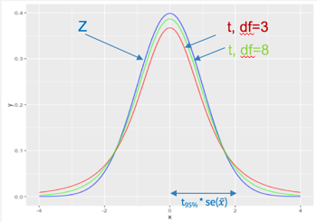

**Описова статистика** – вивчає властивості спостережуваних даних. **Вивідна статистика** – виводимо припущення про властивості розподілу даних з яких походять спостережувані дані.

Описова статистика цікавиться виключно властивостями спостережуваних даних, і не припускає, що ці дані можуть походити з більшої сукупності.Вивідна статистика дозволяє робити висновки про генеральну сукупність на основі вибірки. Впевненість у цих висновках можна представити чисельно. 

Розуміння термінів **"генеральна сукупність"** та **"вибірка"** є надзвичайно важливим для розуміння вивідної статистики. 

"Генеральна сукупність" складається з усіх об’єктів (наприклад людей, лососів в Атлантичному океані, деталей літака) предмету, які хотів би вивчити дослідник, якби в нього була необмежена кількість ресурсів. 
Визначення генеральної сукупності, яка досліджується є першим кроком у вивідній статистиці. Прикладом генеральної сукупності може бути населення США у 2016 році або кількість канадських чоловіків віком 65-70 років з діагнозом серцева недостатність.

Статистичний процес для вивідної та описової статистик однаковий, але трактування різне. Наприклад, середнє значення обчислюється однаково як для популяції так і для вибірки. Для їх розрізнення використовується інша нотація.


Ви можете зауважити, що формули для обчислення дисперсії(а отже і середньоквадратичного відхилення) для генеральної сукупності та вибірки відрізняються. Наш курс є вступним і не передбачає заглиблення в це питання, однак ви можете детальніше прочитати, чому ми робимо цю корекцію (вона ще має назву корекція або ж поправка  Бесселя) за посиланням: <https://en.wikipedia.org/wiki/Bessel%27s_correction#>


Практично всі дослідження базуються на даних, отриманих з вибірок, а не на даних генеральної сукупності з практичних міркувань(обмеження часу та ресурсів). Винятками є дослідження на кшталт U.S.Census(<https://en.wikipedia.org/wiki/United_States_Census_Bureau>), головна мета яких охопити всіх жителів США у визначеному році.

**Репрезентативна вибірка** -представляє генеральну сукупність, можна використовувати для вивідної статистики.**Нерепрезентативна вибірка**: вибірка та генеральну сукупність мають різні характеристики. Використання цієї вибірки призведе до неправильних результатів аналізу.

Розрізняють ймовірнісні вибірки та вибірки сформовані згідно певних  правил. При використанні останніх є високий ризик отримати нерепрезентативну вибірку. Прикладом є "волонтерська вибірка" - коли опитують лише бажаючих взяти участь в дослідженні чи "зручна вибірка" (сonvinience sampling), яка формується з доступних для дослідження об'єктів. Опитування слухачів на форумі цього курсу про їх політичні уподобання (якщо в якості генеральної сукупності виступає все доросле населення України) буде водночас і волонтерською, і зручною вибіркою.

Якщо вам потрібно сформувати репрезентативну вибірку - то **ймовірнісні вибірки** є найкращим вибором.

Найпоширенішим видом ймовірнісної вибірки є **простий випадковий вибір** (simple random sampling). Всі об'єкти генеральної сукупності мають однакову можливість бути вибраними. Також виділяють:

- стратометричний вибір - сукупність ділиться на  страти (наприклад, населення за рівнем освіти чи віковою групою)

-  кластерний вибір - сукупність ділиться на кластери, які однакові за своєю структурою, потім випадковим чином обираються кластери, а тоді елементи цих кластерів

- cистематичний вибір - елементи сукупності впорядковуються і вибирається кожен k-ий елемент (елементи на конвейері з метою виявлення дефектів) 


## Центральна гранична теорема

Нехай ми досліджуємо зріст дорослих чоловіків, які проживають на території Європи. В нашому дослідженні вони представляють генеральну сукупність з параметрами $\mu$ та $\sigma$. Ми можемо сформувати вибірки для оцінки середнього значення зросту дорослого чоловіка. Наприклад, визначити середнє значення зросту дорослого чоловіка та середньоквадратичне відхилення для кожної країни Європи. Чи сформувати 1000 вибірок, випадковим чином обравши 40 чоловіків для кожної. Середнє значення кожної вибірки буде **точковою оцінкою** для середнього значення генеральної сукупності.

Тут маємо три розподіли:

- **розподіл генеральної сукупності** (середнє значення $\mu$, середньоквадратичне відхилення $\sigma$, переважно невідомий)

- **розподіл вибірки** (середнє значення x, середньоквадратчине відхилення s, використовується для оцінки параметрів генеральної сукупності)

- **вибірковий розподіл** - розподіл середніх значень вибірок.
 


**Центральна гранична теорема**: Незалежно від того, який розподіл має змінна у популяції (генеральній сукупності), вибірковий розподіл  середніх значень вибірок має приблизно нормальний розподіл, якщо розмір вибірки принаймі 30.Середнє значення вибіокового розподілу $\mu_x$  дорівнює середньому значенню генеральної сукупності $\mu$, а середньоквадратичне відхилення буде обчислюватись за формулою  $s = \frac{\sigma}{\sqrt{n}}$, де $\sigma$ - середньоквадратичне відхилення генеральної сукупності, а n -  розмір вибірки.

Вибірковий розподіл пропорцій вибірок має приблизно нормальний розподіл за умови наявності принаймі 15 успіхів та 15 невдач, тобто  np ≥ 15 та n(1-p) ≥ 15. При цьому середнє значення пропорцій вибірок $\mu_p$ дорівнює значенню пропорції генеральної сукупності p, а середньоквадратичне відхилення $s(\bar p) =\sqrt{\frac{p(1 - p)}{n}}$.


Знання, що розподіл є нормальним, дозволяє оцінити ймовірність на основі Z-значень. Тобто, використовуючи центральну граничну теорему ми можемо оцінити ймовірність отримати вибірку з певним середнім значенням чи значенням пропорції.

Розглянемо приклади застосування центральної граничної теореми. 

Ви збираєтесь на пробіжку, яка триватиме 2 години. Ви створили плейлист, з випадковим чином обраних 40 пісень. Яка ймовірність що цей плейлист не закінчиться протягом пробіжки? Середня довжина пісні становить 3.45 хв, середньоквадратичне відхилення – 1.63 хв).

Тривалість пробіжки в хвилинах становить 120 хвилин.  Нам потрібно оцінити ймовірність, що сума тривалостей 40 пісень буде довшою ніж 
P(x1 + x2 + … + x40) > 120
P($\bar x$ > 3) ?

Середньоквадратичне відхилення вибіркового розподілу(розподілу середніх значень вибірок) згідно центральної граничної теореми обчислюється за формулою: $s= \frac{\sigma}{\sqrt{n}} = \frac{1.63}{\sqrt{40}} = 0.258$

Знайдемо z-значення:

$$z = \frac{x - \mu}{s} = \frac{3 - 3.45}{0.258} = -1.74$$

Зобразимо розподіл та площу під кривою:

```{r}
library(ggplot2)

ggplot(data.frame(x = c(-3,3)), aes(x)) + 
  geom_vline(xintercept = -1.74, linetype=2, colour="blue") +
  stat_function(fun = dnorm, colour="blue") +
  geom_area(stat = "function", fun = dnorm, fill = "red", xlim = c(-1.74,3)) 

```

Знайдемо ймовірність отримати z-значення -1.74 або більше:

```{r}
pnorm(-1.74, lower.tail = FALSE)
```

Отже, ймовірність того, що плейліст не закінчиться становить 95.9%

Розглянемо інший приклад.
Припустимо, що частка всіх студентів університету, які вживали енергетики протягом останніх 6 місяців становить р = 0.40. Для вибірки n = 200 студентів, яка ймовірність, що відсоток тих, хто вживав енергетики протягом останніх 6 місяців менша ніж 32%?

n = 200
p = 0.40

P($\bar p$ < 0.32) - ?

Перевіримо умови, які потрібні для застосування центральної граничної теореми:

np = 200 $\times$ 0.40 = 80 ≥ 15

n(1-p) = 200 $\times$ (1 - 0.40) = 120 ≥ 15

Умови виконуються.

Обчислимо середньоквадратичне відхилення вибіркового розподілу:

$s(\bar p) =\sqrt{\frac{p(1 - p)}{n}} = \sqrt{\frac{p(1-p)}{n}}= \sqrt{\frac{0.4(1-0.4)}{200}} =0.0346$

z-значення: $\frac{0.32 - 0.40}{0.0346} = -2.31$


Зобразимо розподіл та площу під кривою:

```{r}
ggplot(data.frame(x = c(-3,3)), aes(x)) + 
  geom_vline(xintercept = -2.31, linetype=2, colour="blue") +
  stat_function(fun = dnorm, colour="blue") +
  geom_area(stat = "function", fun = dnorm, fill = "red", xlim = c(-3,-2.31)) 
```

Знайдемо ймовірність отримати z-значення -2.31 або більше:

```{r}
pnorm(-2.31)
```

Ймовірність, що у вибірці з 200 випадковим чином обраних студентів відсоток тих, хто вживав енергетики протягом останніх 6 місяців буде менша ніж 32% становить 1%.

## Довірчий інтервал

**Точкова оцінка** це одне число, яке є нашою найкращою здогадкою про значення параметрів популяції.  Однак, одна точкова оцінка не говорить, наскільки близькою ця оцінка є до справжньої пропорції генеральної сукупності. Тобто наступним кроком має бути оцінка точності цієї точкової оцінки. Інший тип – **інтервальна оцінка** (довірчий інтервал, confidence interval, CI). Це інтервал значень, який з високою ймовірністю містить справжні параметри генеральної сукупності. Ймовірність що цей інтервал містить середнє значення чи значення пропорції генеральної сукупності визначається **рівнем довіри**. Рівень довіри(рівень надійності, confidence level) має значення близьке до одиниці(найбільш поширені значення 90%, 95%, 99%). 


Загальна формула:

**точкова оцінка(estimate) $\pm$  межа похибки(margin of error)**

**точкова оцінка(estimate) $\pm$  критичне значення $\times$середньоквадратичне відхилення точкової оцінки**

Точкова оцінка - значення середнього чи пропорції для вибірки

Критичне значення - це значення для $\frac{1-\alpha}{2}$, де $\alpha$ - рівень довіри. Наприклад, для рівня довіри $\alpha = 95\%$ критичне значення z розподілу становить 1.96(тобто 95% лежать в межах $\pm 1.96$) середньоквадратчиних відхилень. 

Чому ми можемо використати властивості нормального розподілу для побудови довірчого інтервалу? Це нам дозволяє робити центральна гранична теорема, яка говорить, що неважливо який розподіл даних у генеральній сукупності, вибірковий розподіл(тобто розподіл середніх значень вибірок) буде мати нормальний розподіл.

Давайте розглянемо приклад:
Нехай серед 935 випадковим чином обраних респондентів на питання "чи виріте ви в існування розумного життя на інших планетах?" ствердно відповіли 60%. Тобто $\bar p = 0.6$, n=935. $\bar p = 0.6$ - точкова оцінка. Побудуємо інтервальну оцінку, тобто довірчий інтервал для оцінки пропорції тих, хто вірить в життя на інших планетах.
Рівень довіри $\alpha = 95\%$.

Центральна гранична теорема говорить, що при виконанні умов np ≥ 15 та n(1-p) ≥ 15 розподіл пропорцій вибірок буде нормальним, де значення p(пропорція генеральної сукупності) ~ $\bar p$, а середньоквадратичне відхилення обчислюється за формулою $s(\bar p) = \sqrt{\frac{p(1 - p)}{n}}$.
Перевіримо умови:

np = 935 $\times$ 0.6 = 561$ ≥ 15

n(1-p) = 935 $\times$ (1 - 0.6) = 374 ≥ 15

Умови виконуються, тому можемо використовувати центральну граничну теорему для обрахування довірчого інтервалу оцінки для значення пропорції генеральної сукупності. 


Середнє значення вибіркового розподілу дорівнює значенню $\bar p$ = 0.6. 

Середньоквадратичне відхилення цього розподілу обчислюється за формулою $s(\bar p) = \sqrt{\frac{p(1 - p)}{n}} = \sqrt{\frac{0.6 \times (1-0.6)}{935}} = 0.016$ 

Критичне значення для рівня довіри $\alpha = 95\%$  становить 1.96. 

Підставимо отримані значення в формулу, **точкова оцінка(estimate) $\pm$  межа похибки(margin of error)**, де межа похибки дорівнює  **критичне значення $\times$середньоквадратичне відхилення точкової оцінки**. 

Отримаємо:

Довірчий інтервал з рівнем довіри 95% (CI 95%) : 0.6 $\pm$ 1.96 $\times$ 0.016. 

Або  0.6 $\pm$ 0.03136 чи [0.56864, 0.63136]

Тобто ми можемо стверджувати(з впевненістю 95%), що відсоток людей, які вірять в існування життя на інших планетах, згідно нашого дослідження знаходиться в межах [56.864%, 63.136%].

Рівень довіри в 95% для довірчого інтервалу говорить що в ми на 95% можемо бути впевнені, що наша справжнє значення генеральної сукупнсті потрапляє в цей інтервал. Тобто якщо цих інтервалів багато – 95% містять справжнє значення параметра. Це також означає, що його 5% не містять. Якщо ви хочете зменшити кількість таких випадків – можна збільшити рівень довіри, наприклад до 99%. Однак, довірчий інтервал при цьому буде ширший.


Побудуємо довірчі інтервали з рівнем довіри 90%, 95% та 99% для нашого опитування про існування розумного життя на інших планетах. 

Формула для обрахунку $p \pm Z_{90\%} + se(\bar p)$:  Для рівня довіри 90% z-значення становитиме 1.64. Решту даних ми маємо. Тоді **90% CI: **  $0.6 \pm 1.64 \times 0.016$ = [0.57376, 0.62624].

Аналогічно для рівня довіри 95%: 

**95% CI: ** $p \pm Z_{95\%} + se(\bar p) = 0.6 \pm 1.96 \times 0.016$ = [0.56864, 0.63136]

Та для рівня довіри 99%:

**99% CI: ** $p \pm Z_{99\%} + se(\bar p) = 0.6 \pm 2.58 \times 0.016$ = [0.55872, 0.64128]

Бачимо, що що із збільшенням рівня довіри, ширина довірчого інтервалу збільшується, тобто чим більшою є наша впевненість, що значення параметра потрапляє до інтервалу, тим ширшим є цей інтервал.

## Розмір вибірки

Давайте поглянемо на формули для визначення середньоквадратичного відхилення вибіркового розподілу:

$s = \frac{\sigma}{\sqrt n}$ - для середнього значення

$s = \sqrt{\frac{p(1 - p)}{n}}$ - для пропорції

В обох формулах у знаменнику маємо n - розмір вибірки. Відповідно, при збільшенні n, значення середньоквадратичного відхилення(а отже і межі похибки) будуть зменшуватись. Тобто, ми можемо визначити таке n при якому межа похибки набуває визначеного значення.

Розглянемо це на прикладі. Нехай дослідження показало, що 43% дорослих віком від 25 до 35 років співає в душі. Дослідник хоче визначити, чи це справедливо для дорослих віком від 35 років. Яким має бути розмір вибірки, щоб мати межу похибки рівну 5% для рівня довіри 90%?

Для того, щоб перевірити, чи справедливе твердження що 43% дорослих співає в душі для вікової групи ≥ 35 років, спочатку знайдемо межі похибки довірчого інтервалу для вікової групи 25-35 років. 

Рівень довіри $\alpha = 90\%$, критичне значення $Z_{90\%} = 1.64$

$\bar p = 0.43$

Межа похибки: критичне значення $\times$середньоквадратичне відхилення точкової оцінки (згідно умови становить 5%) 

тобто маємо рівняння:

$$0.05 = 1.64 \times \sqrt{\frac{p(1 - p)}{n}} = 1.64485 \times \sqrt{\frac{0.43(1 - 0.43)}{n}}$$

Визначимо з цього рівняння n:

$$0.05 \sqrt n =  1.64485 \times \sqrt{0.43 \times 0.57}$$

$$\sqrt n =  1.64485 \times \frac{\sqrt{0.43 \times 0.57}}{0.05}$$

$$\sqrt n = 16.28651$$

$$n = 16.28651 ^2 = 265.25$$

Тобто, щоб отримати межу похибки 5% (або меншу), потрібно опитати принаймі 266 людей.

# Довірчий інтервал для середнього значення

Давайте розглянемо процес побудови довірчого інтервалу для оцінки середнього значення генеральної сукуаності на основі даних вибірки.

Для визначення екваторіального радіусу планети Марс провели 40 незалежних вимірювань. Ці вимірювання мають середнє значення  $\bar x$ = 3396 км та середньоквадратичне відхилення s = 30 км. Знайдіть 95% довірчий інтервал для екваторіального радіуса планети Марс.

n = 40

$\bar x$ = 3396

s = 30

Центральна гранична теорема говорить, що при n > 30 вибірковий розподіл, тобто розподіл середніх значень є нормальним. Середнє значення цього розподілу $\mu_x = \mu$, а середньоквадратичне відхилення $s = \frac{\sigma}{\sqrt{n}}$, де $\mu$ та $\sigma$ - середнє значення та середньоквадратичне відхилення генеральної сукупності.

Для побудови довірчого інтервалу використаємо формулу:


**точкова оцінка(estimate) $\pm$  межа похибки(margin of error)**

**точкова оцінка(estimate) $\pm$  критичне значення $\times$середньоквадратичне відхилення точкової оцінки**

Для середнього значення з рівнем довіри 95% вона буде виглядати так:

$\bar x  \pm  Z_{95\%} \times \frac{\sigma}{\sqrt n}$

Якщо у нас відоме значення середньоквадратичного відхилення $\sigma$, то можемо використовувати цю формулу. Однак, в реальному житті(як і в прикладі оцінки радуісу Марса), нам зазвичай  **невідоме значення $\sigma$**. 

Що робити в цій ситуації? Для оцінки середньоквадратичного відхилення вибіркового розподілу використовують **середньквадратичне значення вибірки s**, однак в якості теоретичного розподілу середніх значень використовують **t-розподіл**(розподіл Стьюдента).

Є велика кількість t-розподілів, в залежності від кількості ступенів вільності(degrees of freedom) форма цих розподілів відрізняється(а отже і площа під кривою, і ймовірності мати значення більше чи менше заданого).



Що таке ступені вільності? Розглянемо це на прикладі однієї змінної. Нехай у нас є 9 клітинок та 9 чисел. Якщо для перших 8 є можливість вибору, в яку клітинку їх розмістити, то останнє число буде в останній клітинці, що залишиться(без можливості вибору). Тобто тут кількість ступенів вільності становить **n - 1** Для побудови довірчих інтервалів будемо використовувати цю формулу.

Тобто кількість ступенів вільності для нашої вибірки з вимірами радуісу Марса дорівнює n - 1 = 40 - 1 = 39.

Формула для побудови довірчого інтервалу наступна:

$$\bar x  \pm  t_{95\%} \times \frac{s}{\sqrt n}$$

де $t_{95\%}$ - критичне значення t-розподілу з кількістю ступенів вільності n-1(в нашому прикладі 39) для рівня довіри $\alpha = 95\%$

Критичне значення t-статистики залежить від кількості ступенів вільності. Можна користуватисть t-таблицями, але в межах цього курсу ми будемо використовувати функціонал R. Для визначення критичного значення використовується функція `qt` з параметрами $\frac{1-\alpha}{2}$ та кількістю ступенів вільності df. Для нашого прикладу критичне значення рахується так:

```{r}
n = 40
alpha = 0.95
qt((1-alpha)/2, df=n-1, lower.tail = FALSE)
```

Тоді межа похибки(margin of error) обчислюється за формулою $t_{95\%} \times \frac{s}{\sqrt n} = 2.02 \times \frac{30}{\sqrt{40}} = 9.58$

Відповідно довірчий інтервал: 3396 ± 9.58 або [3386.42, 3405.58].

## Покроковий план побудови довірчого інтервалу

* Визначити рівень довіри (поширені значення 90%, 95%, 99%)
  + Визначити середнє значення чи пропорція.
      + Для пропорції: 
          + знаходимо критичне значення z-розподілу для заданого рівня довіри
          + знаходимо межу похибки(margin of error): $Z_{\alpha} \times \sqrt{\frac{p(1 - p)}{n}}$
      + Для середнього значення: 
          + Якщо відоме значення середньоквадратичного відхилення генеральної сукупності:
              + знаходимо критичне значення z-розподілу для заданого рівня довіри
              + знаходимо межу похибки(margin of error): $Z_{\alpha} \times \frac{\sigma}{\sqrt{n}}$
          
          + Якщо значення середньоквадратичного відхилення генеральної сукупності невідоме:
              + знаходимо кількість ступенів вільності за формулою n-1, де n - розмір вибірки
              + знаходимо критичне значення t-розподілу відповідно до кількості ступенів вільності
              + знаходимо межу похибки(margin of error): $t_{\alpha} \times \frac{\sigma}{\sqrt{n}}$
  + Визначаємо межі інтервалу за формулою *точкова оцінка(estimate) $\pm$  межа похибки(margin of error)*
  + Інтерпретація результату


