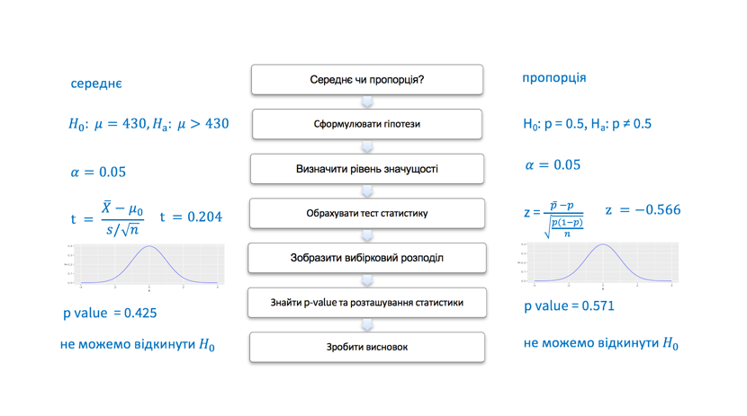

## Тестування гіпотез

Коли дослідники мають очікування щодо параметрів генеральної сукупності – говорять про статистичну гіпотезу. Зазвичай, гіпотеза формулюється як твердження що параметр генеральної сукупності має певне значення або знаходиться в певному інтервалі. Це твердження базується на попередніх дослідженнях та теорії. На основі інформації, отриманої з вибірки оцінюють, чи має сенс (справедливе) це твердження чи ні. Це те, що ми називаємо **тест на значущість**.
Тест на значущість, як і побудова довірчих інтервалів, є методом вивідної статистики. Ми пробуємо оцінити параметри генеральної сукупності на основі вибірки.


Тест на значущість базується на двох гіпотезах: це нульова та альтернативна гіпотези. Нульова гіпотеза позначається як $H_0$, альтернативна як $H_A$. Нульова гіпотеза стверджує, що параметр генеральної сукупності набирає конекретного значення. Ця гіпотеза може бути відхилена, якщо дані вибірки кажуть що це дуже нетипові очікування. Альтернативна гіпотеза стверджує, що параметр, який досліджується має альтернативне значення чи набір значень. Нульова та альтернативна гіпотези завжди взаємовиключні (mutually exclusive).
Коли ви робите тест на значимість, то вважаєте, що нульова гіпотеза правдива поки дані вибірки не дадуть достатньо сильні аргументи, що це не так. Це схоже на суд присяжних. Прокурор пробує переконати суддів, що підсудний винен. Підсудний не має доводити свою невинність і вважається невинним, поки прокурор не доведе інакше.

Як формулюються гіпотези? Нехай дослідження показало, що пульс студентів університету становить 70 ударів за хвилину. Середнє значення попередніх досліджень 72 удари за хвилину. Дослідник хоче визначити чи відрізняються результати вибірки від загальних результатів.

Нульова гіпотеза $H_0: \mu = 72$

Альтернативна гіпотеза $H_A: \mu \neq 72$. Тут маємо так звану двосторонню альтернативну гіпотезу. Ще можна перевіряти односторонні гіпотези: $H_A: \mu  > 72$ або  $H_A: \mu  < 72$. 


## Тестування гіпотез для середнього значення

Розглянемо тестування гіпотез для середнього значення на прикладі.

9 листопада 1965 року в енергосистемі США сталася аварія. 30 мільйонів людей протягом 13 годин  перебували без світла. Це аварія відома як Northeast Blackout <https://en.wikipedia.org/wiki/Northeast_blackout_of_1965> 
Через 9 місяців (10 серпня 1966) в NY Times опубліковане дослідження, яке стверджувало, що значно в Нью Йорку зросла народжуваність. Видання вважало причиною саме Northeast Blackout.
Давайте проаналізуємо кількість новонароджених у перші два тижні серпня 1966 і визначимо, чи це значення статистично відрізняється від звичайного рівня народжуваності в Нью Йорку (середня кількість новонароджених на той час складала 430 на добу).


$\bar x  = 432.21$, 

s = 40.48

n = 14

Сформулюємо нульову гіпотезу: "Відключення електроенергії у листопаді 1965 року впливу на кількість новонароджених не має, тобто середнє значення таке ж, як і в інші місяці".

$H_0 = 430$ (звична кількість новонароджених)

Альтернативна гіпотеза: "Відключення електроенергії у листопаді 1965 має вплив на кількість новонароджених, тобто середнє значення відрізняєітся від 430".

$H_A \neq 430$

Це двостороння альтернатива, що означає що рівень народжуваності відрізняється. Можемо також розглядати односторонню альтернативу, наприклад $H_A > 430$.
 
**Тестова статистика** вимірює різницю між даними отриманої вибірки та нульовою гіпотезою. Фактично тестова статистика відповідає на питання: "Яка відстань у середньоквадратичних відхиленнях між середнім значенням отриманої вибірки та середнім значенням згідно нульової гіпотези?"

Обрахуємо тестову статистику для нашого прикладу.

Для рівня народжуваності в Нью Йорку середнє значення вибірки $\bar x$  становить 432.21, а середнє значення генеральної сукупності $\mu$ згідно нульової гіпотези 430. Середньоквадратичне відхилення вибірки s = 40.48. Згідно центральної граничної теореми, середньоквадратичне відхилення відхилення вибіркового розподілу дорівнює $\frac {\sigma} {\sqrt{n}}$ і тестова статистика буде обчислюватись за формулою:

$$ Z = \frac{\bar X - \mu_0}{\frac{\sigma}{\sqrt{n}}}$$

Z – кількість середньоквадратичних відхилень між середнім значенням вибірки та середнього значення згідно нульової гіпотези

Для обрахування тестової статистика Z потрібно знати середьноквадратичне відхилення генеральної сукупності $\sigma$

Як ми вже знаємо, можемо використати t-розподіл.

Тобто потрібно обрахувати:

$$ t = \frac{\bar X - \mu_0}{\frac{s}{\sqrt{n}}}$$

Для нашого прикладу середнє значення вибірки $\bar x$ 432.21, середнє значення згідно нульової гіпотези $\mu_0$ 430, середньоквадратичне відхилення вибірки s 40.48. Розмір вибірки n = 14.

Тестова статистика: $$ t = \frac{\bar X - \mu_0}{\frac{s}{\sqrt{n}}} =  \frac{432.21 - 430}{\frac{40.48}{\sqrt{14}}} = 0.204$$

Тобто, середнє значення отриманої вибірки знаходиться на відстані 0.204 середньоквадратичних відхилень від середньоквадратичного значення нульової гіпотези. 

Чи ця різниця є статистично значимою? Чи можливо ми отримали це значення випадково? Оцінити це нам допоможе значення ймовірності або ж **p-value**. За припущення, що нульова гіпотеза правдива, p-value відповідає на питання "яка ймовірність отримати значення більш екстремальне ніж наще спостережуване середнє значення?"

Чим менше p-value тим більш нереалістичною є нульова гіпотеза.

Для нашого прикладу тестова статистика t = 0.204. 

За припущення що середнє значення нашої генеральної сукупності 430, яка ймовірність отримати вибірку, з t статистикою 0.204 або більш екстремальне?

Так як ми працюємо з t-розподілом, то знайдемо кількість ступенів вільності: df = n - 1 = 13.

Побудуємо наш t-розподіл з кількістю ступенів вільності df = 13 та зобразимо значення тестової статистики та площі під кривою:

```{r, echo=FALSE, message=FALSE, warning=FALSE}

library(ggplot2)

ggplot(data.frame(x = c(-4,4)), aes(x)) + 
  geom_vline(xintercept = 0.204, linetype=2, colour="blue") +
  stat_function(fun = dt, colour="blue", args = list(df=13)) +
  geom_area(stat = "function", fun = dt, fill = "lightblue", xlim = c(0.204, 4), args = list(df=13)) 

```

Ймовірність отримати таке значення t статистики, за умови, що середнє значення генеральної сукупності становить 430 можна обчислити за формулою (p_value):

```{r}
pt(0.204, df=13, lower.tail = FALSE)
```

Однак, наша гіпотеза двостороння, тому графік буде виглядати так:


```{r, echo=FALSE, message=FALSE}

ggplot(data.frame(x = c(-3,3)), aes(x)) + 
  geom_vline(xintercept = 0.204, linetype=2, colour="blue") +
  geom_vline(xintercept = -0.204, linetype=2, colour="blue") +
  stat_function(fun = dt, colour="blue", args = list(df=13)) +
  geom_area(stat = "function", fun = dt, fill = "lightblue", xlim = c(0.204, 3), args = list(df=13)) +
  geom_area(stat = "function", fun = dt, fill = "lightblue", xlim = c(-3, -0.204), args = list(df=13))

```

а формула для обчислення p-value так:
```{r}
2*pt(0.204, df=13, lower.tail = FALSE)
```

Щоб визначити "статистичну значущість" ми порівнюємо отримане p-value з фіксованим значенням, яке є вирішальним наскільки ми маємо доказів, щоб відкинути нульову гіпотезу. Це вирішальне значення має назву **рівень значущості** та позначаєтся $\alpha$

Загально прийнятим $\alpha$ рівнем є $\alpha =0.05$. Це означає, що докази які ми отримали проти нульової гіпотези настільки сильні, що можуть бути отримані в результаті випадкового збігу не більше ніж в 5% (якщо нульова гіпотеза справедлива).

Якщо p-value менше ніж $\alpha$ говорять, що різниця статистично значима для рівня $\alpha$.

Тобто, для нашого прикладу, де

Гіпотези: 

$H_0: \mu = 430$

$H_A: \mu \neq 430$

Тестова статистика: 

$$t = \frac{\bar X - \mu_0}{\frac{s}{\sqrt{n}}} =  \frac{432.21 - 430}{\frac{40.48}{\sqrt{14}}} = 0.204$$

Ймовірність отримати таку тестову статистику p-value - 0.841.

Порівняємо $\alpha = 0.05$ та p-value = 0.841.

p_value > $\alpha$

Це означає, що для кількості новонароджених у Нью Йорку p-vlaue = 0.814, що не дозволяє відкинути нульову гіпотезу для рівня значущості $\alpha$=0.05. Іншими словами, можна сказати що різниця між нульовою гіпотезою та даними вибірки **не є статистично значущою**. Тобто наші дані не підтверджують гіпотезу, що рівень народжуваності у перші два тижні серпня 1966  відрізняється від звичного. Тобто, відсутність електроенергії  не мало впливу на рівень народжуваності.

В R є вбудований функціонал для проведення тесту на значущість. Це функція `t-test`. 

Наша вибірка за перші чотирнадцять днів серпня:

```{r}
newborns <- c(452, 470, 431, 448, 467, 377, 344, 449, 440, 457, 471, 463, 405, 377)
```

Використаємо функцію `t-test`, в якості параметрів вкажемо `alternative = "two.sided"` - оскільки розглядаємо двосторонню альтернативу, `mu=430` - значення середнього для генеральної сукупності згідно нульової гіпотези та рівень значущості `conf.level = 0.95`:

```{r}
t.test(newborns, alternative = "two.sided", mu=430, conf.level = 0.95)
```

Бачимо, що виведення тесту на значущість включає також довірчий інтервал для цих даних. 

Який зв’язок  між тестом на значущість та довірчим інтервалом?

Твердження "P-значення для двостороннього тесту ≤ 0.05" еквівалентне "95% довірчий інтервал не містить $H_0$ значення", відповідно "P-значення для двостороннього тесту  > 0.05" еквівалентне "95% довірчий інтервал буде містити $H_0$ значення".

У прикладі вище p-value = 0.841 > $\alpha$, довірчий інтервал для рівня довіри 95% [408.8384, 455.5901] містить значення $H_0 = 430$.

## інший підхід

Знайти критичні значення для заданого $\alpha$, зобразити критичні області. Якщо тестова статистика вибірки потрапляє в критичну область - можемо відхилити нульову гіпотезу.

**plot will be here**

## Тестування гіпотез для пропорції

Розглянемо приклад тестування гіпотез для пропорції:

Чи відрізняється відсоток новонароджених хлопчиків від 50%? У вибірці 200 новонароджених, з них 96 хлопчики.


$H_0: p = 0.5$

$H_A: p \neq 0.5$

Рівень довіри $\alpha = 0.05$

Тестова статистика:

$$ z = \frac{\bar p - p}{\sqrt{\frac{p(1-p)}{n}}}$$

$\bar p = \frac{96}{200} = 0.48$,  p = 0.5, n = 200

$z = \frac{\bar p - p}{\sqrt{\frac{p(1-p)}{n}}} = \frac{0.48 - 0.5}{\sqrt{\frac{0.5(1-0.5)}{200}}} = -0.566$

Зобразимо області під кривою для z-статистики (вони симетричні, оскільки використовуємо двосторонню гіпотезу):

```{r, echo=FALSE}

ggplot(data.frame(x = c(-3,3)), aes(x)) + 
  geom_vline(xintercept = 0.566, linetype=2, colour="blue") +
  geom_vline(xintercept = -0.566, linetype=2, colour="blue") +
  stat_function(fun = dnorm, colour="blue") +
  geom_area(stat = "function", fun = dnorm, fill = "lightblue", xlim = c(0.566, 3)) +
  geom_area(stat = "function", fun = dnorm, fill = "lightblue", xlim = c(-3, -0.566))


p.val = 2*pnorm(-0.566)
p.val = 0.571


```

Для кількості новонароджених p-value = 0.571, що не дозволяє відкинути нульову гіпотезу для рівня значущості $\alpha = 0.05$

Іншими словами, можна сказати що різниця між нульовою гіпотезою та даними вибірки не є статистично значущою.

Тобто наші дані не підтверджують гіпотезу, що відсоток хлопчиків серед новонароджених відрізняється від 50%.

В R для тестування гіпотези про значення пропорції можна використовувати функцію `prop.test` з параметрами
`alternative = "two.sided"` (може бути ще `less` або `greater` для односторонніх альтернатив) та `correct = FALSE`
(correct=TRUE означає застосування  Yates' continuity correction <http://www.statisticshowto.com/what-is-the-yates-correction/>)

```{r}
prop.test(96, 200, alternative = "two.sided", correct = FALSE)
```

Як бачимо, довірчий інтервал для рівня надійності 95% [0.4117917, 0.5489621] включає значення $H_0$

## Покроковий план тестування гіпотез




## Помилки І та ІІ типу


При тестуванні тесту на значущість можна отримати помилку двох типів: 
 
 - помилика І типу, коли ми відхиляємо правдиву нульову гіпотезу (і, відповідно, приймаємо хибну альтернативну)
 
 - помилка ІІ типу, коли ми не можемо відхилити хибну нульову гіпотезу
 
Тобто при тестуванні гіпотез маємо чотири можливі наслідки:

 _ | $H_0$ правдива | $H_0$ хибна
------------- | -------------  | -------------
Приймаємо $H_0$  | Правильне рішення | Помилка ІІ типу 
Відкидаємо $H_0$ | Помилка І типу | Правильне рішення 
 
 
Помилка першого типу еквівалентна так званим false positives. Приклад помилки першого типу. Нехай досліджуємо ліки проти певної хвороби. Нульова гіпотеза стверджує, що ці ліки не чинять ніякого впливу на перебіг хвороби. Якщо ми відкидаємо правдиву нульову гіпотезу (робимо помилку І типу), і приймаємо хибну альтерантивну,тобто вважаємо, що використання цих ліків впливає на перебіг хвороби (що, насправді, не так). При збільшенні рівня довіри з 95% до 99% ми зменшуємо ймовірність зробити помилку І типу $\alpha$ (тобто відхилити правдиву нульову гіпотезу) з 5% до 1%. 

Однак, тут є інша небезпека: при цьому збільшується ймовірність зробити помилку ІІ типу. Помилка типу ІІ еквівалентна false negatives. У випадку з ліками не можемо відхилити хибну нульову гіпотезу, тобто вважаємо, що ліки не допомагають, однак, насправді, це не так і хворому могло б значно покращати. Ймовірніть зробити помилку ІІ типу позначається як $\beta$. $1-\beta$ - потужність критерію.


Ще одне пояснення можна переглянути тут: <http://www.slideshare.net/smulford/type-1-and-type-2-errors>

